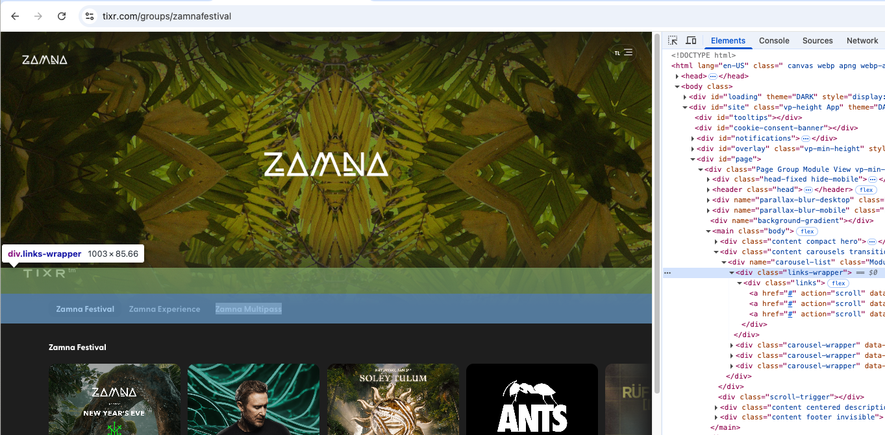

# Tixr Web Bug Report — Header Home-Link Container Masked by `links-wrapper` on certain Groups pages

**Issue Type:** Bug  
**Severity:** High  
**Priority:** P1  
**Environment:**  
- Web (Desktop)  
- Chrome / Firefox / Safari  
- Affects all screen sizes tested



---

## 🐞 Description
The top-left homepage navigation element (`<div class="home-link hide-mobile">`, which contains the Tixr logo link) is being partially or completely masked by the `<div class="links-wrapper">` element.  

Because of this overlap, the home-link container **cannot receive pointer events**, causing the homepage link to become non-functional.

This affects all users navigating from certain Groups pages that have this page structure.

---

## 📌 Steps to Reproduce
1. Navigate to any main Tixr Groups page with this problematic page structure such as: https://www.tixr.com/groups/zamnafestival, https://www.tixr.com/groups/sjearthquakes, or https://www.tixr.com/groups/newcitygas.  
2. Attempt to click the TIXR(tm) logo (located within `<div class="home-link hide-mobile">`).  
3. No navigation occurs.  
4. Open Chrome DevTools → Console  
5. Run the following code to detect the topmost element at the home-link region:

    ```js
    const el = document.querySelector('.home-link.hide-mobile');
    const rect = el.getBoundingClientRect();
    document.elementFromPoint(rect.left + rect.width/2, rect.top + rect.height/2);
    ```

6. Observe the returned element:

    ```
    <div class="links-wrapper">...</div>
    ```

   instead of:

    ```
    <div class="home-link hide-mobile">...</div>
    ```

---

## ✔ Expected Behavior
- The home-link container should sit at the top of the visual hierarchy.  
- Clicking the logo inside `<div class="home-link hide-mobile">` should always navigate users to `https://www.tixr.com/`.  
- No content should overlap the header navigation area.

---

## ❌ Actual Behavior
- The `links-wrapper` element overlaps the home-link container.  
- Clicks intended for the logo/home link are intercepted by `links-wrapper`.  
- The homepage cannot be accessed using the top-left navigation element.  
- Browser hit-testing confirms the masking issue.

---

## 🔍 Root Cause Analysis
The `.links-wrapper` element, which contains category navigation items (e.g., Programmation, Festival Lumen, Bazart), extends vertically upward into the header area, overlapping:

```
<div class="home-link hide-mobile">
```

This overlap causes:

- The home-link container to become **non-interactive**
- Pointer events to be captured by `links-wrapper`
- A breakdown of expected global navigation behavior  

Potential specific causes include:

- Misconfigured layout spacing (margin or padding)
- Absolute or relative positioning errors
- Incorrect stacking context or z-index behavior
- Parent container height misalignment

---

## 🧭 Impact Assessment
| Area | Impact | Notes |
|------|--------|--------|
| Navigation | **High** | The expected header → homepage control is broken |
| UX Consistency | **High** | Violates universal “top-left = home” convention |
| User Trust | Medium | Site feels unresponsive or broken |
| Discoverability | High | Users rarely scroll for an alternate homepage link |
| Conversion Flow | Medium | Users lose a fast way to restart browsing |

This is a **P1 severity** issue because it affects all users and breaks a core navigation pattern.

---

## 🧪 Technical Evidence

### **Hit-Test Output**

```js
const el = document.querySelector('.home-link.hide-mobile');
const rect = el.getBoundingClientRect();
document.elementFromPoint(rect.left + rect.width/2, rect.top + rect.height/2);
```

Produces:

```
<div class="links-wrapper">...</div>
```

### Interpretation
The browser reports that `links-wrapper` is the **topmost element** at the logo/home-link's location, proving that it is obstructing the clickable area.

---

## 🛠 Proposed Fix Options

### **Option A — Fix Layout Spacing (Preferred)**
Ensure `links-wrapper` is positioned below the header nav:

```css
.links-wrapper {
    margin-top: 24px; /* or a corrected value based on design */
}
```

---

### **Option B — Adjust Stacking Context**
Guarantee that the header nav is above content sections:

```css
.home-link.hide-mobile {
    position: relative;
    z-index: 20;
}

.links-wrapper {
    position: relative;
    z-index: 1;
}
```

---

### **Option C — Make the Wrapper Background Non-Interactive (Quick Fix)**
Allow pointer events to pass through unused areas of `links-wrapper`:

```css
.links-wrapper {
    pointer-events: none;
}

.links-wrapper * {
    pointer-events: auto; /* restores clickability of category links */
}
```

---

## ✔ Post-Fix Validation Steps
1. Re-run the hit-test:

    ```js
    const el = document.querySelector('.home-link.hide-mobile');
    const rect = el.getBoundingClientRect();
    document.elementFromPoint(rect.left + rect.width/2, rect.top + rect.height/2);
    ```

    Expected output:

    ```
    <div class="home-link hide-mobile">...</div>
    ```

2. Confirm the logo link successfully navigates home.  
3. Test across desktop breakpoints.  
4. Ensure category navigation inside `links-wrapper` still works.  
5. Validate no layout regressions in header.


