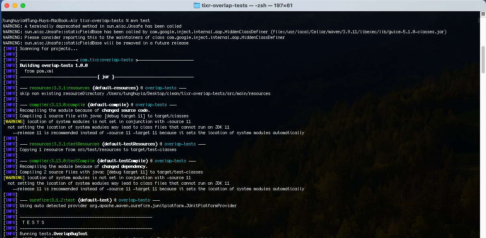
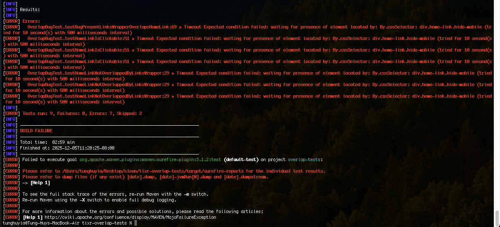
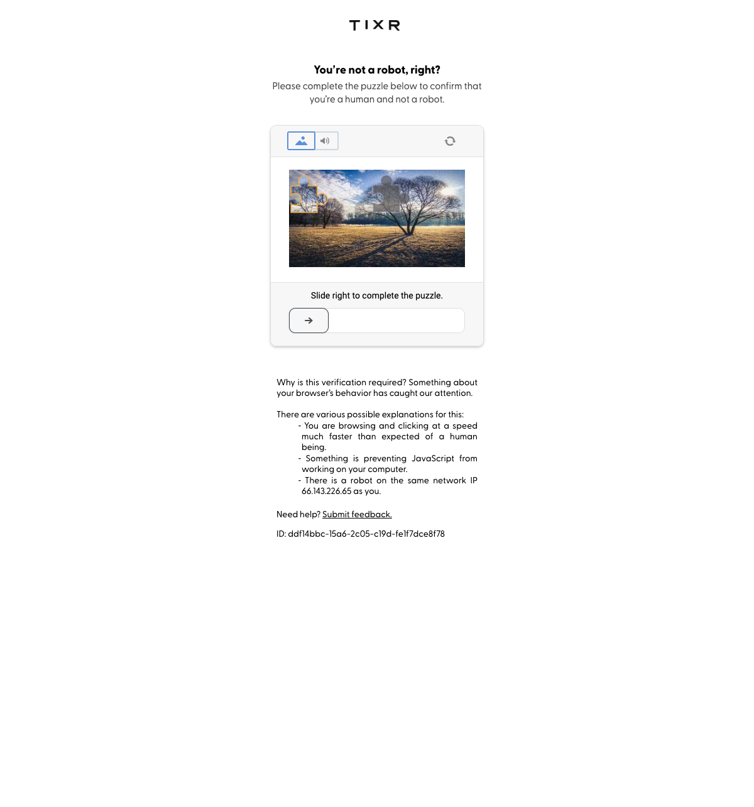

# Tixr Groups Page Overlap Bug Test Suite

Tests for the bug where `<div class="links-wrapper">` overlaps `<div class="home-link hide-mobile">` on /groups pages.

## Prerequisites

- Java 11+
- Maven 3.6+
- Browser drivers (chromedriver, geckodriver) in PATH
- Safari: Enable "Allow Remote Automation" in Develop menu

## Run Tests

**Chrome (default):**
```bash
mvn test
```

**Firefox:**
```bash
mvn test -Dbrowser=firefox
```

**Safari:**
```bash
mvn test -Dbrowser=safari
```

**Run specific test methods:**
```bash
# Fix verification tests (PASS when fixed)
mvn test -Dtest="OverlapBugTest#testHomeLinkNotOverlappedByLinksWrapper"
mvn test -Dtest="OverlapBugTest#testHomeLinkIsClickable"

# Bug reproduction test (PASS when bug exists)
mvn test -Dtest="OverlapBugTest#testBugPresentLinksWrapperOverlapsHomeLink"
```

## Test Data

Edit `src/test/resources/test_data.json` to modify the groups pages being tested.

## Project Structure

```
tixr-overlap-tests/
├── pom.xml
├── src/
│   ├── main/java/pages/
│   │   └── GroupsPage.java      # Page Object
│   └── test/
│       ├── java/tests/
│       │   ├── TestBase.java    # Browser setup
│       │   └── OverlapBugTest.java
│       └── resources/
│           └── test_data.json   # Test URLs
```

## IMPORTANT

Due to DataDome protection on tixr.com, the Selenium tests cannot load the test pages properly so they all fail. I tried using **undetected_chromedriver** and **selenium-stealth** but still no go. I need to talk to the Tixr team to figure out how to bypass DataDome from their end.




